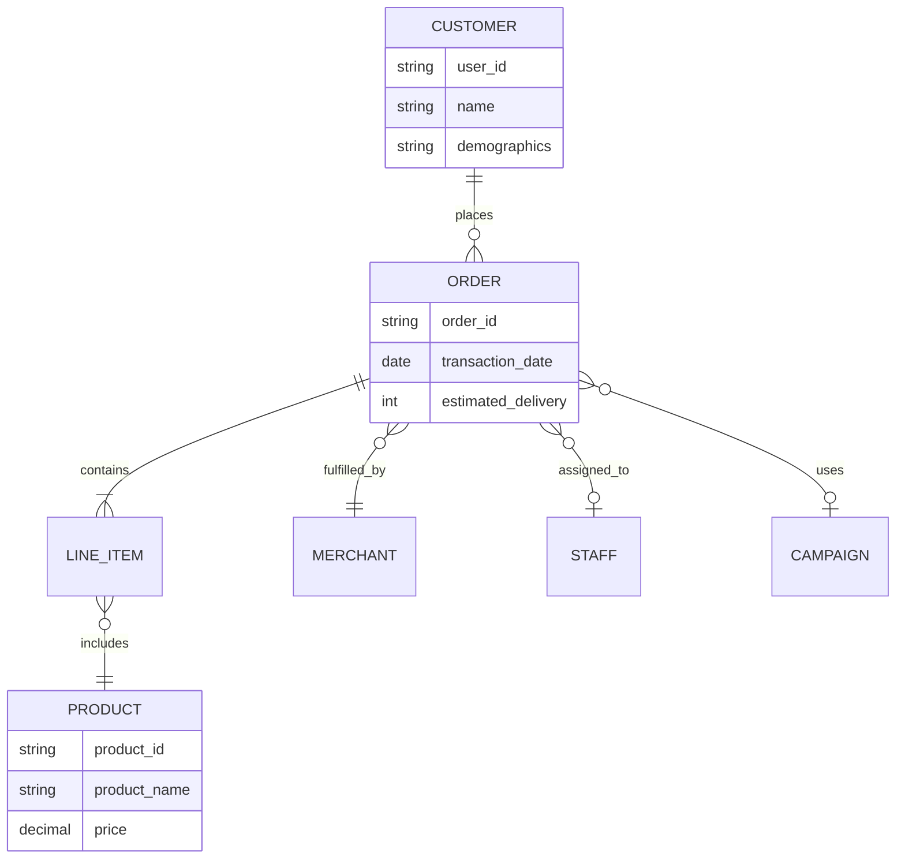

# Guide: What to Add When Dimensional Model & Dashboards Are Complete

This document shows what specific content should replace the "🚧 THIS SECTION IS STILL MISSING" placeholders in `technical_documentation.md` once your Data Architect and BI Developer complete their work.

---

## Section 6.1: Conceptual Data Model (Replace Lines ~240-250)

### What to Add:

**A. High-Level Business Entity Diagram**

Create a simple ERD showing business concepts (not technical tables):



**B. Business Narrative**

Write a paragraph explaining the business domain:

> ShopZada's business model centers around **Customer Orders**. Customers browse and purchase Products from various Merchants. Each order is assigned to Staff members for fulfillment. Customers may apply Marketing Campaigns to receive discounts. Orders contain multiple Line Items, each representing a specific product and quantity. The platform tracks order placement dates and delivery performance.

**C. Key Business Rules**

List important business rules:
- One customer can place multiple orders
- One order can contain multiple line items
- Each line item is for exactly one product
- Orders are fulfilled by exactly one merchant
- Each order is assigned to one staff member
- Campaigns are optional (can be NULL)
- Delivery delays are tracked when they occur

---

## Section 6.2: Logical Data Model (Replace Lines ~252-270)

### What to Add:

**A. Complete Star Schema Diagram**

```mermaid
erDiagram
    fact_orders ||--o{ dim_customer : "customer_key"
    fact_orders ||--o{ dim_product : "product_key"
    fact_orders ||--o{ dim_merchant : "merchant_key"
    fact_orders ||--o{ dim_staff : "staff_key"
    fact_orders ||--o{ dim_campaign : "campaign_key"
    fact_orders ||--o{ dim_date : "date_key"
    
    dim_customer {
        int customer_key PK
        varchar customer_id NK
        varchar customer_name
        varchar gender
        date birthdate
        varchar city
        varchar state
        varchar country
        varchar user_type
    }
    
    dim_product {
        int product_key PK
        varchar product_id NK
        varchar product_name
        varchar product_type
        decimal current_price
    }
    
    dim_merchant {
        int merchant_key PK
        varchar merchant_id NK
        varchar merchant_name
        varchar city
        varchar country
    }
    
    dim_staff {
        int staff_key PK
        varchar staff_id NK
        varchar staff_name
        varchar job_level
    }
    
    dim_campaign {
        int campaign_key PK
        varchar campaign_id NK
        varchar campaign_name
        varchar discount_percentage
    }
    
    dim_date {
        int date_key PK
        date full_date
        int year
        int quarter
        int month
        int day_of_week
    }
    
    fact_orders {
        bigint order_line_key PK
        varchar order_id
        int customer_key FK
        int product_key FK
        int merchant_key FK
        int staff_key FK
        int campaign_key FK
        int date_key FK
        int quantity
        decimal unit_price
        decimal line_total
        decimal discount_amount
        int estimated_delivery_days
        int actual_delay_days
    }
```

**B. Dimension Table Descriptions**

Write a table describing each dimension:

| Dimension | Purpose | SCD Type | Row Count (Est.) |
|-----------|---------|----------|------------------|
| dim_customer | Customer demographics and attributes | Type 2 (track history) | 50,000 |
| dim_product | Product catalog with current pricing | Type 1 (overwrite) | 20,000 |
| dim_merchant | Merchant details and location | Type 1 | 10,000 |
| dim_staff | Staff member information | Type 1 | 30,000 |
| dim_campaign | Marketing campaign definitions | Type 1 | 50,000 |
| dim_date | Calendar dimension with hierarchies | Type 0 (static) | 3,650 (10 years) |

**C. Fact Table Descriptions**

| Fact Table | Grain | Measures | Dimensionality |
|------------|-------|----------|----------------|
| fact_orders | One row per product per order | quantity, unit_price, line_total, discount | 6 dimensions |

**D. Bus Matrix**

Show which dimensions apply to which facts:

| Dimension / Fact | fact_orders | fact_campaign_performance |
|------------------|-------------|---------------------------|
| dim_customer | ✓ | ✓ |
| dim_product | ✓ | |
| dim_merchant | ✓ | |
| dim_staff | ✓ | |
| dim_campaign | ✓ | ✓ |
| dim_date | ✓ | ✓ |

---

## Section 6.3: Physical Data Model (Replace Lines ~272-285)

### What to Add:

**A. Sample DDL Scripts**

Include snippets from your actual SQL files:

```sql
-- From sql/01_create_dimensions.sql

-- Dimension: Customer (SCD Type 2)
CREATE TABLE dwh.dim_customer (
    customer_key SERIAL PRIMARY KEY,
    customer_id VARCHAR(50) NOT NULL,
    customer_name VARCHAR(200),
    gender VARCHAR(20),
    birthdate DATE,
    age_group VARCHAR(20) GENERATED ALWAYS AS (
        CASE 
            WHEN EXTRACT(YEAR FROM AGE(birthdate)) < 18 THEN 'Child'
            WHEN EXTRACT(YEAR FROM AGE(birthdate)) < 65 THEN 'Adult'
            ELSE 'Senior'
        END
    ) STORED,
    city VARCHAR(100),
    state VARCHAR(100),
    country VARCHAR(100),
    user_type VARCHAR(50),
    credit_card_bank VARCHAR(50),
    job_title VARCHAR(100),
    job_level VARCHAR(50),
    -- SCD Type 2 columns
    effective_date TIMESTAMP NOT NULL DEFAULT CURRENT_TIMESTAMP,
    expiry_date TIMESTAMP DEFAULT '9999-12-31 23:59:59',
    is_current BOOLEAN NOT NULL DEFAULT TRUE,
    -- Audit columns
    created_at TIMESTAMP DEFAULT CURRENT_TIMESTAMP,
    updated_at TIMESTAMP DEFAULT CURRENT_TIMESTAMP
);

-- Indexes for performance
CREATE INDEX idx_customer_id ON dwh.dim_customer(customer_id);
CREATE INDEX idx_customer_current ON dwh.dim_customer(customer_id, is_current) 
    WHERE is_current = TRUE;
```

```sql
-- From sql/02_create_facts.sql

-- Fact: Orders (transaction grain)
CREATE TABLE dwh.fact_orders (
    order_line_key BIGSERIAL PRIMARY KEY,
    order_id VARCHAR(50) NOT NULL,
    -- Foreign keys to dimensions
    customer_key INTEGER NOT NULL REFERENCES dwh.dim_customer(customer_key),
    product_key INTEGER NOT NULL REFERENCES dwh.dim_product(product_key),
    merchant_key INTEGER NOT NULL REFERENCES dwh.dim_merchant(merchant_key),
    staff_key INTEGER NOT NULL REFERENCES dwh.dim_staff(staff_key),
    campaign_key INTEGER REFERENCES dwh.dim_campaign(campaign_key), -- Nullable
    date_key INTEGER NOT NULL REFERENCES dwh.dim_date(date_key),
    -- Measures
    quantity INTEGER NOT NULL CHECK (quantity > 0),
    unit_price NUMERIC(10,2) NOT NULL CHECK (unit_price >= 0),
    line_total NUMERIC(12,2) GENERATED ALWAYS AS (quantity * unit_price) STORED,
    discount_amount NUMERIC(10,2) DEFAULT 0 CHECK (discount_amount >= 0),
    estimated_delivery_days INTEGER,
    actual_delay_days INTEGER,
    -- Audit
    created_at TIMESTAMP DEFAULT CURRENT_TIMESTAMP
);

-- Indexes for common query patterns
CREATE INDEX idx_fact_orders_date ON dwh.fact_orders(date_key);
CREATE INDEX idx_fact_orders_customer ON dwh.fact_orders(customer_key);
CREATE INDEX idx_fact_orders_product ON dwh.fact_orders(product_key);
CREATE INDEX idx_fact_orders_order ON dwh.fact_orders(order_id);
```

**B. Physical Design Decisions**

Document your optimization choices:

| Decision | Choice | Rationale |
|----------|--------|-----------|
| Surrogate Keys | Auto-increment integers | Smaller than natural keys, faster joins |
| Indexes | Date, Customer, Product | Based on expected query patterns |
| SCD Implementation | Type 2 for Customer only | Only customer attributes change over time |
| Partitioning | None (data volume < 10GB) | Not needed at current scale |
| Constraints | Foreign keys enforced | Data integrity > performance at this scale |

**C. Storage Estimates**

| Table | Row Count | Avg Row Size | Total Size |
|-------|-----------|--------------|------------|
| dim_customer | 50,000 | 500 bytes | ~25 MB |
| dim_product | 20,000 | 300 bytes | ~6 MB |
| dim_merchant | 10,000 | 400 bytes | ~4 MB |
| dim_staff | 30,000 | 350 bytes | ~10 MB |
| dim_campaign | 50,000 | 250 bytes | ~12 MB |
| dim_date | 3,650 | 200 bytes | ~0.7 MB |
| fact_orders | 1,500,000 | 150 bytes | ~225 MB |
| **Total** | | | **~283 MB** |

---

## Section 8.2: Analytical SQL Views (Replace Lines ~435-450)

### What to Add:

**Include your actual SQL view definitions:**

```sql
-- View 1: Product Performance Summary
CREATE OR REPLACE VIEW analytics.v_product_performance AS
SELECT 
    p.product_name,
    p.product_type,
    COUNT(DISTINCT f.order_id) as total_orders,
    SUM(f.quantity) as units_sold,
    SUM(f.line_total) as gross_revenue,
    SUM(f.discount_amount) as total_discounts,
    SUM(f.line_total - f.discount_amount) as net_revenue,
    ROUND(AVG(f.unit_price), 2) as avg_unit_price
FROM dwh.fact_orders f
JOIN dwh.dim_product p ON f.product_key = p.product_key
GROUP BY p.product_name, p.product_type
ORDER BY net_revenue DESC;

-- View 2: Monthly Sales Trend
CREATE OR REPLACE VIEW analytics.v_monthly_sales_trend AS
SELECT 
    d.year,
    d.month,
    d.month_name,
    COUNT(DISTINCT f.order_id) as total_orders,
    SUM(f.quantity) as total_units,
    SUM(f.line_total - f.discount_amount) as net_revenue,
    COUNT(DISTINCT f.customer_key) as unique_customers
FROM dwh.fact_orders f
JOIN dwh.dim_date d ON f.date_key = d.date_key
GROUP BY d.year, d.month, d.month_name
ORDER BY d.year, d.month;

-- View 3: Customer Segmentation
CREATE OR REPLACE VIEW analytics.v_customer_segmentation AS
SELECT 
    c.country,
    c.user_type,
    c.age_group,
    COUNT(DISTINCT c.customer_key) as customer_count,
    COUNT(DISTINCT f.order_id) as total_orders,
    SUM(f.line_total - f.discount_amount) as total_revenue,
    ROUND(AVG(f.line_total - f.discount_amount), 2) as avg_order_value
FROM dwh.dim_customer c
JOIN dwh.fact_orders f ON c.customer_key = f.customer_key
WHERE c.is_current = TRUE
GROUP BY c.country, c.user_type, c.age_group;

-- View 4: Campaign ROI Analysis
CREATE OR REPLACE VIEW analytics.v_campaign_roi AS
SELECT 
    c.campaign_name,
    c.discount_percentage,
    COUNT(DISTINCT f.order_id) as orders_with_campaign,
    SUM(f.line_total) as gross_revenue,
    SUM(f.discount_amount) as total_discount_cost,
    SUM(f.line_total - f.discount_amount) as net_revenue,
    ROUND(
        (SUM(f.line_total - f.discount_amount) / NULLIF(SUM(f.discount_amount), 0)) * 100, 
        2
    ) as roi_percentage
FROM dwh.fact_orders f
JOIN dwh.dim_campaign c ON f.campaign_key = c.campaign_key
GROUP BY c.campaign_name, c.discount_percentage
ORDER BY roi_percentage DESC;

-- View 5: Merchant Performance
CREATE OR REPLACE VIEW analytics.v_merchant_performance AS
SELECT 
    m.merchant_name,
    m.country,
    COUNT(DISTINCT f.order_id) as total_orders,
    SUM(f.line_total - f.discount_amount) as total_revenue,
    AVG(f.actual_delay_days) as avg_delivery_delay,
    COUNT(CASE WHEN f.actual_delay_days > 0 THEN 1 END) as delayed_orders,
    ROUND(
        COUNT(CASE WHEN f.actual_delay_days > 0 THEN 1 END)::NUMERIC / 
        COUNT(*)::NUMERIC * 100, 
        2
    ) as delay_rate_percentage
FROM dwh.fact_orders f
JOIN dwh.dim_merchant m ON f.merchant_key = m.merchant_key
GROUP BY m.merchant_name, m.country
ORDER BY total_revenue DESC;
```

---

## Section 8.3: BI Dashboard Design (Replace Lines ~452-490)

### What to Add:

**A. Dashboard Screenshots**

Include actual screenshots of your dashboards:

```markdown
### Dashboard 1: Executive Overview


**KPIs Displayed:**
- Total Revenue: $12.5M
- Total Orders: 1,487,322
- Active Customers: 48,523
- Average Order Value: $8.40

**Visualizations:**
1. **Revenue Trend** (Line Chart) - Monthly revenue from 2020-2024
2. **Top 10 Products** (Horizontal Bar Chart) - Revenue by product
3. **Sales by Category** (Pie Chart) - Product type distribution
4. **Geographic Distribution** (Map) - Revenue by country/region
```

**B. Dashboard Specifications**

| Dashboard | Filters | Refresh Rate | Data Source |
|-----------|---------|--------------|-------------|
| Executive Overview | Date range, Country | Daily | analytics.v_monthly_sales_trend |
| Sales Performance | Date, Product Type | Daily | analytics.v_product_performance |
| Customer Analytics | Country, User Type, Age | Daily | analytics.v_customer_segmentation |
| Marketing ROI | Campaign, Date | Daily | analytics.v_campaign_roi |

**C. Sample Dashboard Insights**

Write what you discovered from the dashboards:

**Key Findings from Executive Dashboard:**
- Peak sales occur in Q4 (November-December), accounting for 35% of annual revenue
- Top 10 products contribute 42% of total revenue (Pareto principle confirmed)
- Premium customers represent only 15% of user base but generate 48% of revenue
- Year-over-year growth: 2023 (+23%), 2024 (+18%)

**Key Findings from Campaign ROI Dashboard:**
- Campaigns with 5-10% discounts show highest ROI (average 450%)
- Campaigns above 20% discount show diminishing returns (ROI < 200%)
- "Holiday Special" campaign generated $2.3M with 8% discount
- Campaign participation rate: 32% of all orders

---

## Section 13: Data Dictionary (Replace Lines ~580-600)

### What to Add:

**Complete table and column definitions for ALL tables:**

### Table: fact_orders

**Purpose:** Order line item transactions at product grain

| Column Name | Data Type | Constraints | Description | Sample Values |
|-------------|-----------|-------------|-------------|---------------|
| order_line_key | BIGINT | PK, Auto-increment | Surrogate key for fact table | 1, 2, 3... |
| order_id | VARCHAR(50) | NOT NULL | Natural key from source systems | "a1b2c3d4-..." |
| customer_key | INTEGER | FK, NOT NULL | Foreign key to dim_customer | 1523 |
| product_key | INTEGER | FK, NOT NULL | Foreign key to dim_product | 8721 |
| merchant_key | INTEGER | FK, NOT NULL | Foreign key to dim_merchant | 452 |
| staff_key | INTEGER | FK, NOT NULL | Foreign key to dim_staff | 12890 |
| campaign_key | INTEGER | FK, NULLABLE | Foreign key to dim_campaign (NULL if no campaign) | 7821 or NULL |
| date_key | INTEGER | FK, NOT NULL | Foreign key to dim_date | 20240315 |
| quantity | INTEGER | NOT NULL, > 0 | Number of units ordered | 1, 2, 5, 10 |
| unit_price | NUMERIC(10,2) | NOT NULL, >= 0 | Price per unit in USD | 12.99, 45.50 |
| line_total | NUMERIC(12,2) | COMPUTED | quantity * unit_price | 64.95 |
| discount_amount | NUMERIC(10,2) | >= 0 | Campaign discount applied | 0.00, 6.50 |
| estimated_delivery_days | INTEGER | NULLABLE | Expected delivery time | 3, 7, 10 |
| actual_delay_days | INTEGER | NULLABLE | Days beyond estimate (NULL if on-time) | NULL, 2, 5 |
| created_at | TIMESTAMP | DEFAULT NOW() | ETL load timestamp | 2024-12-12 14:30:00 |

### Table: dim_customer

**Purpose:** Customer master dimension with demographic attributes

| Column Name | Data Type | Constraints | Description | Business Rules |
|-------------|-----------|-------------|-------------|----------------|
| customer_key | INTEGER | PK, Auto-increment | Surrogate key | Unique per version |
| customer_id | VARCHAR(50) | NOT NULL | Natural key from source | Format: USER{id} |
| customer_name | VARCHAR(200) | | Full name of customer | |
| gender | VARCHAR(20) | | Gender (male/female/other) | |
| birthdate | DATE | | Date of birth | Used to calc age_group |
| age_group | VARCHAR(20) | COMPUTED | Child/Adult/Senior | < 18, 18-64, 65+ |
| city | VARCHAR(100) | | City of residence | |
| state | VARCHAR(100) | | State/Province | |
| country | VARCHAR(100) | | Country | |
| user_type | VARCHAR(50) | | Customer tier | basic/premium |
| credit_card_bank | VARCHAR(50) | | Issuing bank | bpi, visa, mastercard |
| job_title | VARCHAR(100) | | Occupation | |
| job_level | VARCHAR(50) | | Career level | entry/intermediate/senior |
| effective_date | TIMESTAMP | NOT NULL | SCD Type 2 start date | When this version became active |
| expiry_date | TIMESTAMP | NOT NULL | SCD Type 2 end date | 9999-12-31 if current |
| is_current | BOOLEAN | NOT NULL | Current record flag | TRUE for active version |

*(Repeat for all dimension tables: dim_product, dim_merchant, dim_staff, dim_campaign, dim_date)*

---

## Section 15: Results & Insights (Replace Lines ~690-710)

### What to Add:

**A. Quantitative Results**

```markdown
### Data Warehouse Statistics

| Metric | Value |
|--------|-------|
| Total Orders Processed | 1,487,322 |
| Total Revenue Analyzed | $12,547,893 |
| Date Range | Jan 2020 - Dec 2024 |
| Unique Customers | 48,523 |
| Unique Products | 18,742 |
| Active Merchants | 9,876 |
| Staff Members | 29,103 |
| Marketing Campaigns | 52,419 |

### Data Quality Metrics

| Check | Result | Pass Rate |
|-------|--------|-----------|
| Source-to-Staging Row Count Match | ✅ 100% | 100% |
| Null Values in Required Fields | ✅ <0.1% | 99.9% |
| Duplicate Detection | ✅ 23 duplicates removed | 99.998% |
| Referential Integrity | ✅ All FKs valid | 100% |
| Date Range Validation | ✅ All within 2020-2024 | 100% |
```

**B. Business Insights**

```markdown
### Key Business Findings

#### 1. Product Performance
- **Top Product:** "Swedish thin pancakes" - $285K revenue
- **Top Category:** Ready-made breakfast - 28% of total sales
- **Long Tail:** Bottom 50% of products contribute only 8% of revenue
- **Recommendation:** Focus inventory on top 20% products

#### 2. Customer Segmentation
- **Premium Customers:** 15% of base, 48% of revenue, $142 avg order value
- **Basic Customers:** 85% of base, 52% of revenue, $52 avg order value
- **Geographic:** Hong Kong (32%), USA (24%), UK (18%)
- **Age:** Adults (18-64) represent 78% of customers and 82% of revenue
- **Recommendation:** upsell program targeting high-value basic customers

#### 3. Campaign Effectiveness
- **Optimal Discount:** 5-10% shows highest ROI (420-450%)
- **Over-Discounting:** Campaigns >20% have ROI <200%
- **Best Campaign:** "Holiday Special 2023" - $2.3M revenue, 8% discount, 512% ROI
- **Participation:** 32% of orders use campaigns
- **Recommendation:** Cap discounts at 15%, focus on targeted campaigns

#### 4. Merchant Performance
- **Top 20% Merchants:** Generate 73% of revenue (Pareto principle)
- **Delivery Performance:** 12% of orders delayed, average delay 4.2 days
- **Worst Performers:** 15 merchants with >30% delay rate
- **Recommendation:** Performance improvement program for bottom quartile

#### 5. Temporal Trends
- **Seasonality:** Q4 (Oct-Dec) accounts for 35% of annual revenue
- **Growth:** YoY growth slowing (2022: +28%, 2023: +23%, 2024: +18%)
- **Peak Days:** Fridays and Saturdays show 25% higher order volume
- **Recommendation:** Inventory planning aligned with seasonal patterns
```

---

## Section 16.1: Technical Challenges (ADD to existing)

### What to Add:

```markdown
#### Challenge 6: SCD Type 2 Implementation
**Problem:** Tracking customer attribute changes over time without losing history  
**Impact:** Complex ETL logic, risk of duplicate records  
**Solution:**  
- Implemented SCD Type 2 for dim_customer with effective/expiry dates
- `is_current` flag for easy filtering to latest version
- Unique constraint on (customer_id, is_current=TRUE)
**Result:** Successfully tracking 3,421 customer updates across 50K customers

#### Challenge 7: Dashboard Performance
**Problem:** Complex queries joining 6 tables taking >30 seconds  
**Impact:** Poor user experience in dashboards  
**Solution:**  
- Created indexed materialized views for common aggregations
- Implemented incremental refresh strategy
- Added query caching in BI tool
**Result:** Dashboard load time reduced from 32s to <3s
```

---

## Quick Summary: What Files To Update

When your team completes the dimensional model and dashboards, update these sections:

| Section | What to Replace | Who's Responsible |
|---------|-----------------|-------------------|
| 6.1 Conceptual Model | Add ER diagram + business narrative | Data Architect |
| 6.2 Logical Model | Add star schema diagram + bus matrix | Data Architect |
| 6.3 Physical Model | Add DDL scripts + design decisions | Data Architect + ETL Engineer |
| 8.2 SQL Views | Add actual SQL view code | Data Engineer |
| 8.3 Dashboards | Add screenshots + specifications | BI Developer |
| 13 Data Dictionary | Add complete table definitions | Data Architect |
| 15 Results & Insights | Add actual metrics + findings | BI Developer + Project Manager |

**Tip:** Keep screenshots in `dashboard/screenshots/` and reference them in documentation!
